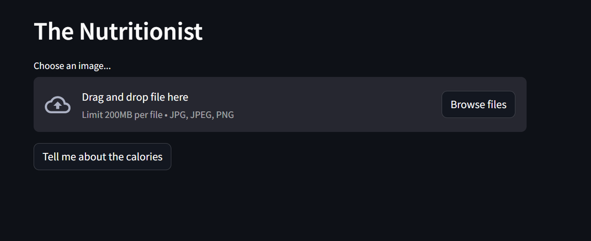
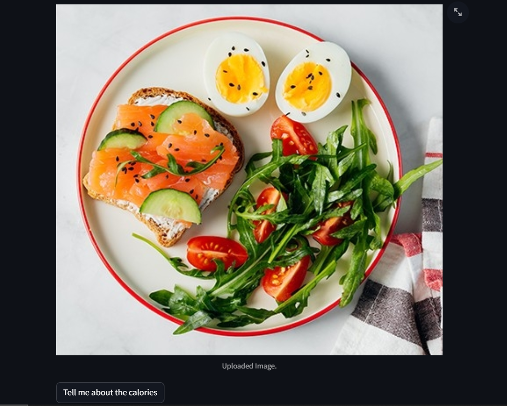
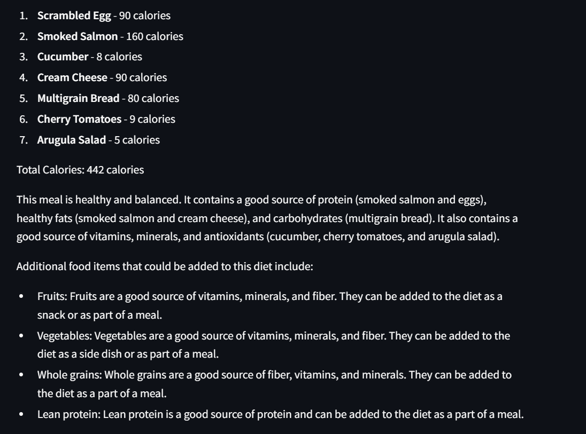

The Nutritionist

Food image recognition: Identifies food items using Gemini-Pro-Vision model.
Calorie calculation: Estimates total calories in the image.
Nutritional breakdown: Provides details and calorie intake for each identified item.
Diet assessment: Categorizes the meal as healthy, balanced, or unhealthy.
Recommendation generator: Suggests healthy additions to balance the diet.

Benefits:
Convenience: Analyze meals on the go, no special equipment needed.
Dietary awareness: Understand food choices and their impact.
Calorie control: Track calorie intake and manage weight goals.
Balanced diet guidance: Receive personalized suggestions for healthier choices.
Educational tool: Learn about nutritional content of different foods.

Image 1: Represents the developed user interface, showcasing the design and layout.

Image 2: Depicts the uploaded image by the user.

Image 3: Illustrates response generated by the application based on the user's input.
